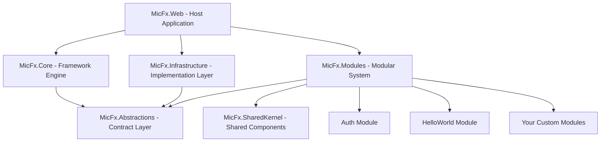

# 🚀 Getting Started with MicFx Framework

## 📋 **Overview**

**MicFx Framework** adalah modular ASP.NET Core framework yang dirancang untuk pengembangan aplikasi enterprise dengan arsitektur yang bersih, scalable, dan maintainable. Framework ini mengimplementasikan prinsip-prinsip clean architecture, modular design, dan convention over configuration.

## ⚡ **Quick Start (5 Menit)**

### **1. Prerequisites**
- .NET 8.0 SDK atau lebih baru
- Node.js 18.0+ dan npm (untuk Tailwind CSS)
- Visual Studio 2022 atau VS Code
- SQL Server (LocalDB untuk development)
- Git

### **2. Clone & Run**
```bash
# Clone repository
git clone https://github.com/your-org/setup-micfx.git
cd setup-micfx

# Restore .NET packages
dotnet restore

# Install Node.js dependencies dan build Tailwind CSS
cd src/MicFx.Web
npm install
npm run build
cd ../..

# Run aplikasi
dotnet run --project src/MicFx.Web
```

### **3. Akses Aplikasi**
- **Web App**: http://localhost:5000
- **Admin Panel**: http://localhost:5000/admin
- **API Documentation**: http://localhost:5000/swagger
- **Health Checks**: http://localhost:5000/health

### **4. Default Login**
```
Email: admin@micfx.dev
Password: Admin123!
```

## 🏗️ **Arsitektur Overview**



## 📁 **Project Structure**

```
setup-micfx/
├── 📁 src/                          # Source code
│   ├── 📁 MicFx.Web/               # Host application
│   ├── 📁 MicFx.Core/              # Framework engine
│   ├── 📁 MicFx.Infrastructure/    # Implementation layer
│   ├── 📁 MicFx.Abstractions/      # Contract interfaces
│   ├── 📁 MicFx.SharedKernel/      # Shared components
│   └── 📁 Modules/                 # Modular system
│       ├── 📁 MicFx.Modules.Auth/  # Authentication module
│       └── 📁 MicFx.Modules.HelloWorld/ # Demo module
├── 📁 tests/                       # Test projects
├── 📁 docs/                        # Documentation
├── 📄 MicFx.sln                    # Solution file
└── 📄 README.md                    # Project readme
```

## 🎯 **Tutorial: Membuat Module Pertama**

### **Step 1: Buat Module Structure**
```bash
# Buat folder module baru
mkdir src/Modules/MicFx.Modules.Blog
cd src/Modules/MicFx.Modules.Blog

# Buat struktur folder
mkdir Api Controllers Domain Services Views
```

### **Step 2: Buat Project File**
```xml
<!-- MicFx.Modules.Blog.csproj -->
<Project Sdk="Microsoft.NET.Sdk.Web">
  <PropertyGroup>
    <TargetFramework>net8.0</TargetFramework>
    <Nullable>enable</Nullable>
    <ImplicitUsings>enable</ImplicitUsings>
  </PropertyGroup>

  <ItemGroup>
    <ProjectReference Include="../../MicFx.SharedKernel/MicFx.SharedKernel.csproj" />
    <ProjectReference Include="../../MicFx.Abstractions/MicFx.Abstractions.csproj" />
  </ItemGroup>
</Project>
```

### **Step 3: Buat Module Manifest**
```csharp
// Manifest.cs
using MicFx.SharedKernel.Modularity;

namespace MicFx.Modules.Blog;

public class Manifest : ModuleManifestBase
{
    public override string Name => "Blog";
    public override string Version => "1.0.0";
    public override string Description => "Blog management module";
    public override string Author => "Your Name";
    public override int Priority => 50;
    public override bool IsCritical => false;
    public override string[] Dependencies => new[] { "Auth" };
}
```

### **Step 4: Buat Module Startup**
```csharp
// Startup.cs
using MicFx.Core.Modularity;
using MicFx.SharedKernel.Modularity;

namespace MicFx.Modules.Blog;

public class BlogStartup : ModuleStartupBase
{
    public override IModuleManifest Manifest { get; } = new Manifest();

    protected override void ConfigureModuleServices(IServiceCollection services)
    {
        // Register module services
        services.AddScoped<IBlogService, BlogService>();
    }
}
```

### **Step 5: Buat Domain Entity**
```csharp
// Domain/BlogPost.cs
using System.ComponentModel.DataAnnotations;

namespace MicFx.Modules.Blog.Domain;

public class BlogPost
{
    public int Id { get; set; }
    
    [Required]
    [StringLength(200)]
    public string Title { get; set; } = string.Empty;
    
    [Required]
    public string Content { get; set; } = string.Empty;
    
    [StringLength(100)]
    public string Author { get; set; } = string.Empty;
    
    public DateTime CreatedAt { get; set; } = DateTime.UtcNow;
    public DateTime? UpdatedAt { get; set; }
    public bool IsPublished { get; set; } = false;
}
```

### **Step 6: Buat Service Interface & Implementation**
```csharp
// Services/IBlogService.cs
using MicFx.Modules.Blog.Domain;

namespace MicFx.Modules.Blog.Services;

public interface IBlogService
{
    Task<IEnumerable<BlogPost>> GetAllPostsAsync();
    Task<BlogPost?> GetPostByIdAsync(int id);
    Task<BlogPost> CreatePostAsync(BlogPost post);
    Task<BlogPost> UpdatePostAsync(BlogPost post);
    Task DeletePostAsync(int id);
}

// Services/BlogService.cs
using MicFx.Abstractions.Logging;
using MicFx.Modules.Blog.Domain;

namespace MicFx.Modules.Blog.Services;

public class BlogService : IBlogService
{
    private readonly IStructuredLogger<BlogService> _logger;
    private readonly List<BlogPost> _posts = new(); // In-memory untuk demo

    public BlogService(IStructuredLogger<BlogService> logger)
    {
        _logger = logger;
        SeedData();
    }

    public async Task<IEnumerable<BlogPost>> GetAllPostsAsync()
    {
        _logger.LogInformation("Getting all blog posts");
        return await Task.FromResult(_posts.Where(p => p.IsPublished));
    }

    public async Task<BlogPost?> GetPostByIdAsync(int id)
    {
        _logger.LogInformation("Getting blog post {PostId}", id);
        return await Task.FromResult(_posts.FirstOrDefault(p => p.Id == id));
    }

    public async Task<BlogPost> CreatePostAsync(BlogPost post)
    {
        post.Id = _posts.Count + 1;
        post.CreatedAt = DateTime.UtcNow;
        _posts.Add(post);
        
        _logger.LogInformation("Created blog post {PostId}: {Title}", post.Id, post.Title);
        return await Task.FromResult(post);
    }

    public async Task<BlogPost> UpdatePostAsync(BlogPost post)
    {
        var existing = _posts.FirstOrDefault(p => p.Id == post.Id);
        if (existing != null)
        {
            existing.Title = post.Title;
            existing.Content = post.Content;
            existing.UpdatedAt = DateTime.UtcNow;
            existing.IsPublished = post.IsPublished;
        }
        
        _logger.LogInformation("Updated blog post {PostId}", post.Id);
        return await Task.FromResult(existing ?? post);
    }

    public async Task DeletePostAsync(int id)
    {
        var post = _posts.FirstOrDefault(p => p.Id == id);
        if (post != null)
        {
            _posts.Remove(post);
            _logger.LogInformation("Deleted blog post {PostId}", id);
        }
        
        await Task.CompletedTask;
    }

    private void SeedData()
    {
        _posts.AddRange(new[]
        {
            new BlogPost
            {
                Id = 1,
                Title = "Welcome to MicFx Blog",
                Content = "This is your first blog post using MicFx Framework!",
                Author = "MicFx Team",
                IsPublished = true
            },
            new BlogPost
            {
                Id = 2,
                Title = "Getting Started with Modules",
                Content = "Learn how to create your first module in MicFx Framework.",
                Author = "Developer",
                IsPublished = true
            }
        });
    }
}
```

### **Step 7: Buat API Controller**
```csharp
// Api/BlogController.cs
using Microsoft.AspNetCore.Mvc;
using MicFx.SharedKernel.Common;
using MicFx.Modules.Blog.Domain;
using MicFx.Modules.Blog.Services;

namespace MicFx.Modules.Blog.Api;

[ApiController]
[Route("api/blog")]
[Produces("application/json")]
public class BlogController : ControllerBase
{
    private readonly IBlogService _blogService;

    public BlogController(IBlogService blogService)
    {
        _blogService = blogService;
    }

    [HttpGet]
    public async Task<ActionResult<ApiResponse<IEnumerable<BlogPost>>>> GetAllPosts()
    {
        var posts = await _blogService.GetAllPostsAsync();
        return Ok(ApiResponse<IEnumerable<BlogPost>>.Ok(posts, "Posts retrieved successfully"));
    }

    [HttpGet("{id:int}")]
    public async Task<ActionResult<ApiResponse<BlogPost>>> GetPost(int id)
    {
        var post = await _blogService.GetPostByIdAsync(id);
        if (post == null)
        {
            return NotFound(ApiResponse<BlogPost>.Error("Post not found", new[] { "POST_NOT_FOUND" }));
        }

        return Ok(ApiResponse<BlogPost>.Ok(post, "Post retrieved successfully"));
    }

    [HttpPost]
    public async Task<ActionResult<ApiResponse<BlogPost>>> CreatePost([FromBody] BlogPost post)
    {
        var createdPost = await _blogService.CreatePostAsync(post);
        return CreatedAtAction(nameof(GetPost), new { id = createdPost.Id }, 
            ApiResponse<BlogPost>.Ok(createdPost, "Post created successfully"));
    }

    [HttpPut("{id:int}")]
    public async Task<ActionResult<ApiResponse<BlogPost>>> UpdatePost(int id, [FromBody] BlogPost post)
    {
        post.Id = id;
        var updatedPost = await _blogService.UpdatePostAsync(post);
        return Ok(ApiResponse<BlogPost>.Ok(updatedPost, "Post updated successfully"));
    }

    [HttpDelete("{id:int}")]
    public async Task<ActionResult<ApiResponse<object>>> DeletePost(int id)
    {
        await _blogService.DeletePostAsync(id);
        return Ok(ApiResponse<object>.Ok(new { }, "Post deleted successfully"));
    }
}
```

### **Step 8: Buat MVC Controller**
```csharp
// Controllers/BlogController.cs
using Microsoft.AspNetCore.Mvc;
using MicFx.Modules.Blog.Services;

namespace MicFx.Modules.Blog.Controllers;

[Route("blog")]
public class BlogController : Controller
{
    private readonly IBlogService _blogService;

    public BlogController(IBlogService blogService)
    {
        _blogService = blogService;
    }

    [HttpGet]
    public async Task<IActionResult> Index()
    {
        var posts = await _blogService.GetAllPostsAsync();
        return View(posts);
    }

    [HttpGet("{id:int}")]
    public async Task<IActionResult> Details(int id)
    {
        var post = await _blogService.GetPostByIdAsync(id);
        if (post == null)
        {
            return NotFound();
        }

        return View(post);
    }
}
```

### **Step 9: Buat Views**
```html
<!-- Views/Blog/Index.cshtml -->
@model IEnumerable<MicFx.Modules.Blog.Domain.BlogPost>
@{
    ViewData["Title"] = "Blog Posts";
}

<div class="container mx-auto px-4 py-8">
    <h1 class="text-3xl font-bold mb-8">Blog Posts</h1>
    
    <div class="grid gap-6">
        @foreach (var post in Model)
        {
            <div class="bg-white rounded-lg shadow-md p-6">
                <h2 class="text-xl font-semibold mb-2">
                    <a href="/blog/@post.Id" class="text-blue-600 hover:text-blue-800">
                        @post.Title
                    </a>
                </h2>
                <p class="text-gray-600 mb-4">@post.Content.Substring(0, Math.Min(150, post.Content.Length))...</p>
                <div class="text-sm text-gray-500">
                    By @post.Author on @post.CreatedAt.ToString("MMM dd, yyyy")
                </div>
            </div>
        }
    </div>
</div>
```

### **Step 10: Register Module**
```csharp
// Di MicFx.Web/Program.cs atau Startup.cs
[assembly: MicFxModule(typeof(MicFx.Modules.Blog.BlogStartup))]
```

### **Step 11: Add to Solution**
```bash
# Add project to solution
dotnet sln add src/Modules/MicFx.Modules.Blog/MicFx.Modules.Blog.csproj

# Add project reference to Web
dotnet add src/MicFx.Web/MicFx.Web.csproj reference src/Modules/MicFx.Modules.Blog/MicFx.Modules.Blog.csproj
```

### **Step 12: Test Module**
```bash
# Run aplikasi
dotnet run --project src/MicFx.Web

# Test endpoints
curl http://localhost:5000/api/blog
curl http://localhost:5000/blog
```

## 🎉 **Selamat!**

Anda telah berhasil membuat module pertama dengan MicFx Framework! Module Blog Anda sekarang memiliki:

- ✅ **REST API** endpoints di `/api/blog`
- ✅ **MVC Pages** di `/blog`
- ✅ **Dependency Injection** dengan services
- ✅ **Structured Logging** terintegrasi
- ✅ **Auto-Discovery** oleh framework
- ✅ **Convention-based Routing**

## 🎨 **Frontend Development dengan Tailwind CSS**

### **Development Workflow**
```bash
# Start Tailwind CSS watch mode (terminal 1)
cd src/MicFx.Web
npm run watch

# Start aplikasi (terminal 2)
cd ../..
dotnet run --project src/MicFx.Web
```

### **Tailwind CSS Commands**
```bash
# Build CSS untuk production
npm run build:css

# Watch mode untuk development
npm run watch:css

# Build dan minify untuk production
npm run build:prod
```

### **Styling Components**
```html
<!-- Contoh penggunaan Tailwind CSS -->
<div class="bg-white rounded-lg shadow-md p-6 hover:shadow-lg transition-shadow">
    <h2 class="text-xl font-semibold text-gray-800 mb-4">Card Title</h2>
    <p class="text-gray-600 leading-relaxed">Card content with Tailwind styling.</p>
    <button class="mt-4 bg-blue-500 hover:bg-blue-600 text-white px-4 py-2 rounded-md transition-colors">
        Action Button
    </button>
</div>
```

## 🚀 **Next Steps**

1. **Explore Admin Integration** - Tambahkan admin interface untuk blog management
2. **Add Database** - Integrasikan dengan Entity Framework
3. **Add Authentication** - Secure endpoints dengan Auth module
4. **Add Validation** - Implement input validation
5. **Add Tests** - Write unit dan integration tests
6. **Add Health Checks** - Monitor module health
7. **Customize UI** - Sesuaikan tampilan dengan Tailwind CSS

## 📚 **Learn More**

- [Module Development Guide](module-development.md)
- [API Reference](api-reference.md)
- [Architecture Guide](architecture-guide.md)
- [Testing Guide](testing-guide.md)

## 🆘 **Need Help?**

- Check [Troubleshooting Guide](troubleshooting.md)
- Browse [HelloWorld Module](../src/Modules/MicFx.Modules.HelloWorld/) untuk contoh lengkap
- Review [Auth Module](../src/Modules/MicFx.Modules.Auth/) untuk implementasi advanced

---

**Selamat coding dengan MicFx Framework!** 🎯 