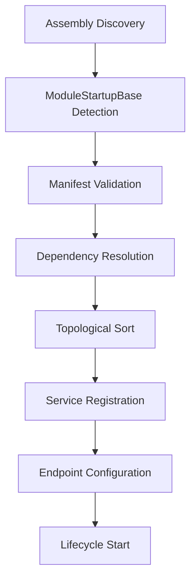
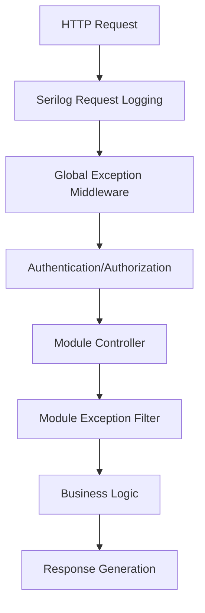

# 🏗️ MicFx.Core - Framework Engine

## 🎯 **Peran dalam Arsitektur**

**MicFx.Core** adalah **Engine Layer** dalam arsitektur MicFx Framework yang berfungsi sebagai:

- **Framework Engine**: Inti dari seluruh operasi framework
- **Module Management**: Sistem manajemen module lifecycle dan dependencies
- **Configuration Management**: Sistem konfigurasi terpusat dan validation
- **Exception Handling**: Global exception handling dan filtering
- **Request Pipeline**: Middleware dan filters untuk request processing
- **Extension Points**: Extension methods untuk easy framework integration

## 🏗️ **Prinsip Design**

### **1. Separation of Concerns**
```csharp
// Configuration terpisah dari implementasi
ConfigurationManager -> IConfiguration -> ModuleConfiguration

// Exception handling di multiple layers
GlobalExceptionMiddleware -> ModuleExceptionFilter -> Business Logic
```

### **2. Dependency Management**
```csharp
// Smart dependency resolution
ModuleDependencyResolver -> TopologicalSort -> StartupOrder
```

### **3. Lifecycle Management**
```csharp
// Complete module lifecycle
NotLoaded -> Loading -> Loaded -> Starting -> Started -> Stopping -> Stopped
```

---

## 📂 **Struktur Folder**

```
📦 MicFx.Core/
├── 📂 Configuration/                # ⚙️ Configuration Management
│   ├── ConfigurationManager.cs         # Central configuration manager
│   └── ModuleConfigurationBase.cs      # Base class untuk module config
├── 📂 Extensions/                   # 🔧 Framework Extensions
│   ├── ConfigurationExtensions.cs      # Configuration DI registration
│   ├── ExceptionHandlingExtensions.cs  # Exception handling setup
│   └── ModuleDependencyExtensions.cs   # Module dependency management
├── 📂 Filters/                      # 🎯 Action Filters
│   └── ModuleExceptionFilter.cs        # Module-level exception filter
├── 📂 Middleware/                   # 🛡️ Request Pipeline
│   └── GlobalExceptionMiddleware.cs    # Global exception handling
├── 📂 Modularity/                   # 🧩 Module System
│   ├── ModuleDependencyResolver.cs     # Dependency resolution engine
│   ├── ModuleLifecycleManager.cs       # Module lifecycle management
│   ├── ModuleHealthCheck.cs            # Module health monitoring
│   ├── ModuleManifestBase.cs           # Base manifest implementation
│   └── ModuleStartupBase.cs            # Base module startup class
└── MicFx.Core.csproj               # 📦 Project configuration
```

---

## 🔧 **Komponen Utama**

### **1. Configuration Management (⚙️)**

#### **MicFxConfigurationManager**
```csharp
public class MicFxConfigurationManager : IMicFxConfigurationManager
{
    // Centralized configuration with validation
    void RegisterModuleConfiguration<T>(IModuleConfiguration<T> configuration);
    ValidationResult ValidateAllConfigurations();
    Task ReloadConfigurationsAsync();
    ConfigurationSummary GetConfigurationSummary();
}
```

**Fitur:**
- ✅ **Type-Safe Configuration**: Strongly-typed configuration classes
- ✅ **Validation**: Built-in Data Annotations validation
- ✅ **Hot Reload**: Runtime configuration reload
- ✅ **Change Notifications**: Event-driven configuration changes
- ✅ **Auto Registration**: Automatic module configuration discovery

**Contoh Penggunaan:**
```csharp
// Dalam module
public class HelloWorldConfiguration : ModuleConfigurationBase<HelloWorldConfig>
{
    public override string ModuleName => "HelloWorld";
    
    public HelloWorldConfiguration(IConfiguration config, ILogger<HelloWorldConfiguration> logger) 
        : base(config, logger) { }
        
    protected override ValidationResult ValidateCustomRules(HelloWorldConfig value)
    {
        if (value.MaxGreetings <= 0)
            return new ValidationResult("MaxGreetings must be positive");
            
        return ValidationResult.Success!;
    }
}

// Dalam Startup.cs
protected override void ConfigureModuleServices(IServiceCollection services)
{
    services.AddModuleConfiguration<HelloWorldConfig>(provider =>
        new HelloWorldConfiguration(
            provider.GetRequiredService<IConfiguration>(),
            provider.GetRequiredService<ILogger<HelloWorldConfiguration>>()
        )
    );
}
```

### **2. Module System (🧩)**

#### **ModuleLifecycleManager**
```csharp
public class ModuleLifecycleManager
{
    // Complete lifecycle management
    Task StartAllModulesAsync(CancellationToken cancellationToken = default);
    Task StopAllModulesAsync(CancellationToken cancellationToken = default);
    Task StartModuleAsync(string moduleName, CancellationToken cancellationToken = default);
    Task RestartModuleAsync(string moduleName, CancellationToken cancellationToken = default);
    Task ReloadModuleAsync(string moduleName, CancellationToken cancellationToken = default);
    
    // Health monitoring
    Task<ModuleHealthDetails> CheckModuleHealthAsync(string moduleName);
    Dictionary<string, ModuleStateInfo> GetAllModuleStates();
}
```

**Module States:**
```
NotLoaded -> Loading -> Loaded -> Starting -> Started
    ↓           ↓        ↓         ↓         ↓
   Error ←─────┴────────┴─────────┴─────────┘
    ↓
Stopping -> Stopped
```

#### **ModuleDependencyResolver**
```csharp
public class ModuleDependencyResolver
{
    // Dependency management
    void RegisterModule(IModuleManifest manifest);
    ModuleDependencyValidationResult ValidateDependencies();
    List<string> GetStartupOrder();
    List<string> GetShutdownOrder();
    
    // Advanced dependency analysis
    List<string> GetAllDependencies(string moduleName);
    List<string> GetDependents(string moduleName);
}
```

**Fitur:**
- ✅ **Topological Sorting**: Smart dependency-based startup order
- ✅ **Circular Dependency Detection**: Prevents dependency loops
- ✅ **Missing Dependency Detection**: Validates all dependencies exist
- ✅ **Version Conflict Detection**: Framework version compatibility
- ✅ **Module Conflict Detection**: Handles conflicting modules

#### **ModuleStartupBase**
```csharp
public abstract class ModuleStartupBase : IMicFxModule, IModuleLifecycle
{
    public abstract IModuleManifest Manifest { get; }
    
    // Service registration
    protected virtual void ConfigureModuleServices(IServiceCollection services) { }
    protected virtual void ConfigureModuleConfiguration(IServiceCollection services) { }
    
    // Endpoint configuration
    protected virtual void ConfigureModuleEndpoints(IEndpointRouteBuilder endpoints) { }
    
    // Lifecycle hooks
    public virtual async Task OnLoadingAsync(CancellationToken cancellationToken = default) { }
    public virtual async Task OnStartedAsync(CancellationToken cancellationToken = default) { }
    public virtual async Task OnErrorAsync(Exception error, CancellationToken cancellationToken = default) { }
    
    // Exception helpers
    protected BusinessException CreateBusinessException(string message, string errorCode = "BUSINESS_ERROR");
    protected ValidationException CreateValidationException(string message, List<ValidationError> errors);
}
```

**Auto-Routing System:**
```csharp
// API Controllers: /api/{module}/{controller}/{action}
[ApiController] -> /api/hello-world/greeting/get

// MVC Controllers: /{module}/{controller}/{action}
Controller -> /hello-world/greeting/index

// Admin Controllers: /admin/{module}/{controller}/{action}
Areas/Admin -> /admin/hello-world/greeting/index
```

### **3. Exception Handling (🛡️)**

#### **GlobalExceptionMiddleware**
```csharp
public class GlobalExceptionMiddleware
{
    // Comprehensive exception handling
    - Handles all unhandled exceptions
    - Creates standardized API responses
    - Logs with full context and correlation IDs
    - Environment-aware error detail disclosure
    - Structured logging dengan Serilog properties
}
```

#### **ModuleExceptionFilter**
```csharp
public class ModuleExceptionFilter : IExceptionFilter
{
    // Module-level exception filtering
    - Second line of defense before global middleware
    - Module context extraction
    - Exception type-specific handling
    - Controller/action context logging
}
```

**Exception Hierarchy:**
```
Exception
├── MicFxException (Base)
│   ├── BusinessException (LogLevel.Warning)
│   ├── ValidationException (LogLevel.Information)
│   ├── SecurityException (LogLevel.Warning)
│   ├── ConfigurationException (LogLevel.Error)
│   └── ModuleException (LogLevel.Error)
└── Standard .NET Exceptions (LogLevel.Error)
```

**Contoh Penggunaan:**
```csharp
// Dalam module controller
public class HelloWorldController : ControllerBase
{
    [HttpPost]
    public async Task<IActionResult> CreateGreeting(CreateGreetingRequest request)
    {
        // Business validation
        if (string.IsNullOrEmpty(request.Message))
        {
            throw new ValidationException("Message is required", new[]
            {
                new ValidationError("Message", "Message cannot be empty")
            });
        }
        
        // Business logic error
        if (await IsGreetingLimitExceeded())
        {
            throw new BusinessException("Greeting limit exceeded", "GREETING_LIMIT_EXCEEDED");
        }
        
        // Success path
        var greeting = await CreateGreetingAsync(request);
        return Ok(ApiResponse<Greeting>.Ok(greeting, "Greeting created successfully"));
    }
}
```

### **4. Extensions (🔧)**

#### **Framework Integration Extensions**
```csharp
// Configuration Management
services.AddMicFxConfigurationManagement(configuration, options => {
    options.AutoRegisterConfigurations = true;
    options.EnableConfigurationMonitoring = true;
    options.ValidateOnStartup = true;
});

// Exception Handling
services.AddMicFxExceptionHandling(options => {
    options.EnableGlobalExceptionMiddleware = true;
    options.EnableModuleExceptionFilter = true;
    options.IncludeStackTraceInDevelopment = true;
});

// Module System
services.AddMicFxModulesWithDependencyManagement();
```

---

## 🚀 **Integration Flow**

### **1. Application Startup**
```csharp
// Program.cs
var builder = WebApplication.CreateBuilder(args);

// 🔧 Core Configuration
builder.Services.AddMicFxConfigurationManagement(builder.Configuration);

// 🧩 Module System
builder.Services.AddMicFxModulesWithDependencyManagement();

// 🛡️ Exception Handling
builder.Services.AddMicFxExceptionHandling();

var app = builder.Build();

// 🛡️ Exception Middleware
app.UseMicFxExceptionHandling();

// 🧩 Module Lifecycle
await app.UseMicFxModulesWithLifecycleManagementAsync();
```

### **2. Module Registration Flow**


### **3. Request Processing Flow**


---

## 🧪 **Development Patterns**

### **1. Creating New Module**
```csharp
// 1. Manifest
public class Manifest : ModuleManifestBase
{
    public override string Name => "YourModule";
    public override string Version => "1.0.0";
    public override string Description => "Your module description";
    public override string Author => "Your Name";
    
    public override string[] Dependencies => new[] { "RequiredModule" };
    public override bool SupportsHotReload => true;
    public override int Priority => 100;
}

// 2. Startup
public class Startup : ModuleStartupBase
{
    public override IModuleManifest Manifest { get; } = new Manifest();
    
    protected override void ConfigureModuleServices(IServiceCollection services)
    {
        services.AddScoped<IYourService, YourService>();
    }
    
    protected override void ConfigureModuleConfiguration(IServiceCollection services)
    {
        services.AddModuleConfiguration<YourModuleConfig>(provider =>
            new YourModuleConfiguration(
                provider.GetRequiredService<IConfiguration>(),
                provider.GetRequiredService<ILogger<YourModuleConfiguration>>()
            )
        );
    }
}
```

### **2. Module Configuration**
```csharp
public class YourModuleConfig
{
    [Required]
    [StringLength(100)]
    public string ApiKey { get; set; } = string.Empty;
    
    [Range(1, 1000)]
    public int MaxRequests { get; set; } = 100;
    
    public bool EnableLogging { get; set; } = true;
}

public class YourModuleConfiguration : ModuleConfigurationBase<YourModuleConfig>
{
    public override string ModuleName => "YourModule";
    
    public YourModuleConfiguration(IConfiguration config, ILogger<YourModuleConfiguration> logger) 
        : base(config, logger) { }
        
    protected override ValidationResult ValidateCustomRules(YourModuleConfig value)
    {
        if (value.EnableLogging && string.IsNullOrEmpty(value.ApiKey))
            return new ValidationResult("ApiKey required when logging is enabled");
            
        return ValidationResult.Success!;
    }
}
```

### **3. Module Controllers**
```csharp
// API Controller - Auto-routed to /api/your-module/*
namespace MicFx.Modules.YourModule.Api;

[ApiController]
public class YourModuleController : ControllerBase
{
    private readonly IYourService _yourService;
    
    public YourModuleController(IYourService yourService)
    {
        _yourService = yourService;
    }
    
    [HttpGet] // GET /api/your-module
    public async Task<ActionResult<ApiResponse<Data>>> Get()
    {
        var data = await _yourService.GetDataAsync();
        return Ok(ApiResponse<Data>.Ok(data, "Data retrieved successfully"));
    }
    
    [HttpPost("create")] // POST /api/your-module/create
    public async Task<ActionResult<ApiResponse<Data>>> Create(CreateRequest request)
    {
        var data = await _yourService.CreateAsync(request);
        return Ok(ApiResponse<Data>.Ok(data, "Data created successfully"));
    }
}

// MVC Controller - Auto-routed to /your-module/*
namespace MicFx.Modules.YourModule.Controllers;

public class YourModuleController : Controller
{
    public IActionResult Index() // GET /your-module
    {
        return View();
    }
    
    public IActionResult Detail(int id) // GET /your-module/detail/123
    {
        return View();
    }
}

// Admin Controller - Auto-routed to /admin/your-module/*
namespace MicFx.Modules.YourModule.Areas.Admin.Controllers;

public class YourModuleController : Controller
{
    public IActionResult Index() // GET /admin/your-module
    {
        return View();
    }
    
    public IActionResult Manage() // GET /admin/your-module/manage
    {
        return View();
    }
}
```

---

## 🔄 **Lifecycle Hooks**

### **Module Lifecycle Events**
```csharp
public class Startup : ModuleStartupBase, IModuleLifecycle
{
    public override async Task InitializeAsync(CancellationToken cancellationToken = default)
    {
        // Initialize resources and setup module
        await InitializeResourcesAsync();
        await StartBackgroundServicesAsync();
    }
    
    public override async Task ShutdownAsync(CancellationToken cancellationToken = default)
    {
        // Graceful shutdown - cleanup resources
        await StopBackgroundServicesAsync();
        await CleanupResourcesAsync();
    }
}
```

> **Catatan:** Hot reload support dan multiple lifecycle hooks telah dihapus untuk menyederhanakan framework dan meningkatkan performa. Hanya dua hooks essential yang tersisa: Initialize dan Shutdown.

---

## 📊 **Monitoring & Diagnostics**

### **Health Checks**
```csharp
// Built-in module health check
app.UseHealthChecks("/health/modules", new HealthCheckOptions
{
    Predicate = check => check.Name == "modules",
    ResponseWriter = async (context, report) =>
    {
        var response = new
        {
            Status = report.Status.ToString(),
            Modules = report.Entries.ToDictionary(kvp => kvp.Key, kvp => new
            {
                Status = kvp.Value.Status.ToString(),
                Description = kvp.Value.Description,
                Duration = kvp.Value.Duration
            })
        };
        await context.Response.WriteAsync(JsonSerializer.Serialize(response));
    }
});
```

### **Configuration Monitoring**
```csharp
// Configuration management dengan monitoring
services.AddMicFxConfigurationManagement(configuration, options =>
{
    options.EnableConfigurationMonitoring = true;
    options.MonitoringIntervalMs = 30000; // 30 seconds
    options.EnableChangeNotifications = true;
});

// Subscribe to configuration changes
services.AddSingleton<IConfigurationChangeHandler>(provider =>
{
    var handler = new ConfigurationChangeHandler();
    var notificationService = provider.GetRequiredService<IConfigurationChangeNotificationService>();
    
    notificationService.ConfigurationChanged += (sender, args) =>
    {
        // Handle configuration changes
        handler.HandleConfigurationChanged(args);
    };
    
    return handler;
});
```

---

## ⚠️ **Important Notes**

### **1. Module Dependencies**
```csharp
// ✅ BENAR: Declare dependencies in manifest
public class Manifest : ModuleManifestBase
{
    public override string[] Dependencies => new[] { "Auth", "Logging" };
    public override string[] OptionalDependencies => new[] { "Cache" };
}

// ❌ SALAH: Hard reference ke module lain tanpa dependency declaration
// Ini akan menyebabkan startup order issues
```

### **2. Configuration Validation**
```csharp
// ✅ BENAR: Always validate configuration
protected override ValidationResult ValidateCustomRules(YourConfig value)
{
    if (value.MaxConnections <= 0)
        return new ValidationResult("MaxConnections must be positive");
    
    if (string.IsNullOrEmpty(value.ApiKey))
        return new ValidationResult("ApiKey is required");
        
    return ValidationResult.Success!;
}

// ❌ SALAH: Skip validation - akan menyebabkan runtime errors
```

### **3. Exception Handling**
```csharp
// ✅ BENAR: Use framework exception types dengan module context
throw CreateBusinessException("Invalid operation", "INVALID_OPERATION");
throw CreateValidationException("Validation failed", validationErrors);

// ❌ SALAH: Throw generic exceptions
throw new Exception("Something went wrong"); // Tidak ada context
```

---

## 🔗 **Dependencies**

```xml
<PackageReference Include="Microsoft.Extensions.DependencyInjection.Abstractions" Version="9.0.6" />
<PackageReference Include="Microsoft.Extensions.Logging.Abstractions" Version="9.0.6" />
<PackageReference Include="Serilog" Version="4.3.0" />
<PackageReference Include="System.Text.Json" Version="9.0.6" />
<ProjectReference Include="../MicFx.SharedKernel/MicFx.SharedKernel.csproj" />
<ProjectReference Include="../MicFx.Abstractions/MicFx.Abstractions.csproj" />
```

**Peran Dependencies:**
- **Microsoft.Extensions.*** - ASP.NET Core infrastructure
- **Serilog** - Structured logging engine
- **System.Text.Json** - JSON serialization for responses
- **MicFx.SharedKernel** - Common types dan base classes
- **MicFx.Abstractions** - Interface contracts

---

*Folder ini adalah jantung dari MicFx Framework. Semua operasi framework, lifecycle management, dependency resolution, dan exception handling dikelola dari sini. Core engine yang robust ini memungkinkan development modular yang scalable dan maintainable.* 